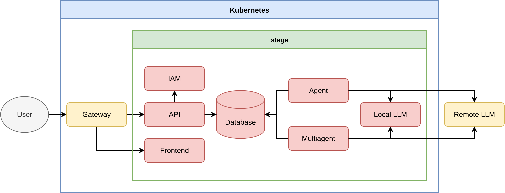

# Kubernetes Observability

Prometheus and Grafana observability stack for Kubernetes clusters.

## Architecture



## Components

- **Prometheus** — scrapes and stores metrics from all cluster workloads
- **Grafana** — visualises Prometheus metrics with dashboards and alerts

## Deployment

### Local

Requires [Rancher Desktop](https://rancherdesktop.io/).

Env variables can be found in `helm/environments/local.yaml`.

```sh
kubectl config use-context rancher-desktop
helmfile -f helm/helmfile.yaml -e local sync
```

### Dev

Env variables can be found in `helm/environments/dev.yaml`.

Deployment is orchestrated by the CI/CD workflow in `.github`.

Access at:

```
https://dev.{domain}/grafana
```

### Prod

Env variables can be found in `helm/environments/prod.yaml`.

Deployment is orchestrated by the CI/CD workflow in `.github`.

Access at:

```
https://prod.{domain}/grafana
```

## Links

- [Cloudfleet](https://cloudfleet.ai/) — managed Kubernetes provider
- [Prometheus](https://prometheus.io/) — metrics collection and storage
- [Grafana](https://grafana.com/) — metrics visualisation and alerting
- [Prometheus Helm chart](https://github.com/prometheus-community/helm-charts) — community Helm chart for Prometheus
- [Grafana Helm chart](https://github.com/grafana/helm-charts) — official Helm chart for Grafana
